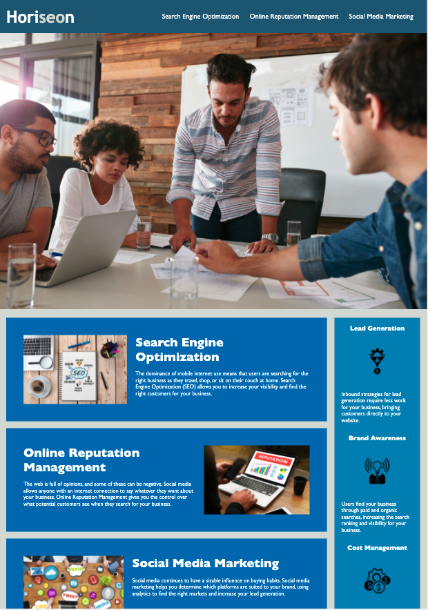

# HTML-CSS-Git: Code Refactor

# Description

Web accessibility has become an important consideration for businesses. It helps people with disabilities access a website using assistive technologies such as screen readers,video captions.

With that note i have refactored the code for a marketing agency called Horiseon to be more accessible.The Semantic elements has been added to help structure the code thats been created, making it more readable and easier to maintain.Alt attributes are added so it specifies an alternate text for an area, if the image cannot be displayed.

Website URL: https://akhilasrinagula.github.io/HTML-CSS-Challenge/

Repository URL: https://github.com/AkhilaSrinagula/HTML-CSS-Challenge.git

# Screenshot

The following image resembles the appearance of web application

